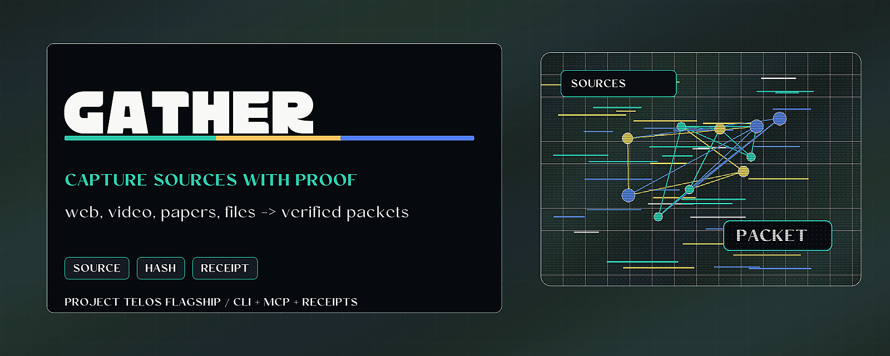

<p align="center">
  
</p>
<!-- Project mark: docs/brand/gather-mark.svg -->

# gather

> Capture sources as verified research packets.

[Project Telos](https://harperz9.github.io) | [gather](https://github.com/HarperZ9/gather) | [crucible](https://github.com/HarperZ9/crucible) | [index](https://github.com/HarperZ9/index) | [forum](https://github.com/HarperZ9/forum) | [telos](https://github.com/HarperZ9/telos)

[](https://github.com/HarperZ9/gather/actions/workflows/ci.yml)


## Try it

```bash
pip install gather-engine
python examples/demo.py
```

Open the visual proof surface at [`examples/gather-demo.html`](examples/gather-demo.html).

## Why it matters

Research breaks when sources become a blur. gather keeps method, ref, hash, and derivation visible, so a team can use harder sources without losing the trail a model, reviewer, or later agent will need.

## Work with it

Bring papers, transcripts, local docs, source bundles, or awkward public materials that need provenance before synthesis. Useful pressure right now is source-adapter testing, research-lab feedback, and grassroots funding for harder intake lanes.

## What to test first

- Point gather at a mixed source set: one local document, one public page, one PDF, and one derived note.
- Check whether each output item keeps source, method, hash, and derivation clear enough for another person to review later.
- Try to break the boundary between fetched text and inferred text. A useful bug report is one where a derived statement can be mistaken for a direct source.

## Current status

- **Release:** `gather-engine 1.5.0`; command `gather`; Python 3.11+; zero third-party runtime dependencies in core.
- **Operator surface:** `gather status --json`, `gather doctor --json`, `gather demo --json`, and `gather mcp` expose the Project Telos action envelope and native MCP tools: `gather.status`, `gather.doctor`, `gather.docs`, `gather.arxiv`, and `gather.run`. The same CLI is available from source checkouts with `python -m gather`. Catalog-producing CLI and MCP paths share the `gather.catalog-digest/v1` envelope with digest verification status, `gather.run` accepts either config paths or inline config objects for host-neutral MCP calls, and the status payload now advertises shared CLI/MCP/plugin/IDE/TUI/app contracts for enterprise, research, creative, scientific, and education workflows.
- **Public role:** source intake for Project Telos: gather feeds index maps, forum routing, crucible verdicts, and telos workbench receipts without promoting source claims beyond their evidence.
- **Housekeeping:** [CHANGELOG.md](CHANGELOG.md) records the post-1.5 operator-spine and MCP updates separately from the 1.5.0 completion milestone.

- **Enterprise readiness:** [docs/ENTERPRISE-READINESS.md](docs/ENTERPRISE-READINESS.md) records the large-context, action-receipt, readability, and host-integration contract for unattended agent workflows.

## What it does

Research lives behind awkward access. Captions and comments on a video, papers behind an
arXiv gate, a library buried in a repo, an API with a credential wall, a fact that exists
only across scattered fragments and has to be put together. Most tools handle one of those
and break on the rest, and when they do reach something, you cannot tell later whether a
line was pulled straight from the source or pieced together along the way.

Gather is the research-intake organ that handles all of it cohesively, and records how.
It is the one place in the constellation where network access, third-party tools, and
credentials are allowed to live, isolated behind source adapters, so the rest stays clean.
Every item it brings back carries a provenance receipt, and a run emits a witnessed digest
that index, refine, and the crucible consume.

## Reach anywhere, and say how

The aim is to pull information from anywhere, including the extremely difficult: gated APIs,
auth and paywalls, JavaScript-walled pages, scanned PDFs, audio, obscure formats, and
information that is not sitting in one place but has to be synthesized from fragments. Many of
these ship today: alongside video, web, feed, and docs, there are adapters for arXiv papers,
PDFs, authenticated JSON APIs, JavaScript-rendered pages (a headless browser), scanned images
(OCR), and audio (transcription). Each records HOW it reached the content, so the accountability
is in place before the harder reach is trusted.

Two adapters are honest about their reach in their receipts. The `web` adapter reads the static
HTML a server returns and does not run JavaScript, so a client-rendered page yields only its
shell, and `http-get` says exactly that; the `browser` adapter runs a real headless browser and
records `browser-extract`, so you know JavaScript was executed. The browser is the most exposed
edge: its host guard covers only the first navigation, and a rendered page then follows its own
redirects and sub-requests unguarded, so do not point it at untrusted URLs where internal
services are reachable (see the threat model in [ARCHITECTURE.md](ARCHITECTURE.md)).

That accountability is one rule: the receipt records how each item was obtained. A
transcript read from captions, a page read through a browser, text recognized from a scan,
speech transcribed from audio, and a fact synthesized from fragments are all valid items,
but they are not equally direct. The `method` on every item keeps that on the record
(`yt-dlp`, `browser-extract`, `ocr`, `transcribe`, `synthesized`), so a quote is never
confused with an inference, and what was hard to get is never dressed up as if it were
lying in the open.

A derived item (one assembled or inferred from other items, rather than fetched) is the
sharp case, and the receipt is built for it. Its sha256 fingerprints the inference itself,
not its sources, because it is a new statement and can only witness itself; a `derived_from`
field records the content hash of each input, a re-checkable pointer back to the exact
source content. The digest seal folds in `method` and `derived_from` alongside the hash, so
relabelling an inference as a direct fetch, or quietly rewriting what it was built from,
breaks the seal exactly as altering the content does.

The honesty is mechanical where it can be. The `method="synthesized"` label is reachable
only through the `Synthesizer` seam: the bare `gather.derive` builder defaults to `compiled`
and refuses to stamp `synthesized` at all, so a bare call can never forge a synthesis. With no
edge wired in, the default `NullSynthesizer` performs a deterministic, extractive *compilation*:
it assembles inputs verbatim, labels them `compiled`, invents nothing. What the seam attests is
that the configured edge produced the text; that the edge is actually a model is the operator's
responsibility, the same trust as choosing the browser binary or the API token (point the seam at
`cat` and you get a verbatim echo labelled `synthesized`). And `derived_from` records the inputs
supplied to the edge, an upper bound: a model may ignore some or generate beyond them, so it
attests availability, not use.

## The discipline

- **One isolated impure edge.** Each source is a small adapter behind a single `Source`
  shape: `fetch(target) -> list[Item]`. The adapter can use the network, a tool, a
  credential, a browser, whatever the source demands; the rest of Gather imports none of
  that. Awkward access is an adapter problem, not a system problem.
- **A receipt on every item.** Each `Item` carries a `Provenance` (source, ref, method,
  time, and a sha256 of the content). Re-hash the content and you can confirm it is what
  was obtained, unaltered.
- **A witnessed digest out.** A run folds its items' receipts into one re-checkable seal.
  Downstream organs consume the digest; the seal lets a reader confirm it was not altered.
- **Scope to the work.** A deterministic scope filter keeps what serves the theses and
  drops the rest, and records how many it dropped.
- **A peer, not a feature.** Gather is deliberately impure, so it is not part of index
  (which is zero-dependency, offline, and deterministic, and would forfeit exactly that
  if it grew a scraper). It composes through the digest seam, the way Forum does.

## Install

```bash
pip install gather-engine
```

The distribution is `gather-engine`; it installs the `gather` command and the `gather` package
(`import gather`). The core is pure standard library; a few adapters call an external tool
(`yt-dlp`, `pdftotext`, a headless `chromium`, `tesseract`, `whisper`), which you install only if
you use that adapter.

## Try it in the field

Gather is the right first test when the hard part is not answering, but preserving what the answer was built from.

- **Doctor / clinical admin:** collect intake notes, policy text, and prior instructions with source receipts before a model summary becomes action.
- **Media / newsroom:** keep quotes, source pages, transcripts, and derived claims apart, so an editor can see what was fetched directly and what was inferred.
- **Research / funding review:** turn scattered PDFs, pages, feeds, and notes into a witnessed digest that another tool or person can re-check before deciding.

Project Telos: <https://harperz9.github.io>. GitHub: <https://github.com/HarperZ9>. Peer flagships: [crucible](https://github.com/HarperZ9/crucible), [index](https://github.com/HarperZ9/index), [forum](https://github.com/HarperZ9/forum), and [the telos engine](https://github.com/HarperZ9/telos).

I am looking for verification, testing against real workflows, early traction from people willing to inspect receipts, and possibly modest grassroots research funding or pointers.

## Watch it work

`examples/demo.py` parses an already-harvested video (a yt-dlp `info.json` plus its `.vtt`
captions) into items, each with a provenance receipt, scope-filters them, folds them into a
witnessed digest, then tampers with one receipt to show the seal catch it. All offline, no
install, nothing downloaded:

```bash
python examples/demo.py        # one video parsed, scoped, digested, then a receipt catches tampering
python examples/pipeline.py    # the whole organ: run -> store -> verify -> recall, offline
```

```
parsed 3 items from one video, each with a receipt:
  metadata   abc123  sha256=40d9839ffb0e...  verify=True
  transcript abc123  sha256=f798cd2c334c...  verify=True
  comment    c1  sha256=301cf39d5091...  verify=True

scope to ['tile','monotile']: kept 3, dropped 0
witnessed digest: 3 receipts, seal 7da7dc456b11..., verified True

after tampering one receipt, digest verifies: False  <- caught
```

(The hash and seal prefixes above are illustrative; the load-bearing facts are the `verify`
results, which the test suite pins.)

The `gather` CLI fetches live from each adapter; every fetch command takes the same `--scope`,
`--json`, and `--store` (the `run` and `corpus` commands are driven by a config file and
sub-actions instead). Of the commands shown here, web/feed/docs are pure standard library and only
`video` needs an external tool (`yt-dlp`); the harder adapters (pdf, browser, ocr, transcribe) each
shell out to their own external tool, never a Python dependency, as the module list notes:

```bash
gather docs ./research-notes --scope "rubik,group theory"   # local files, offline
gather web  "https://example.com/article" --store ./corpus  # static page, kept in a corpus
gather feed "https://example.com/feed.xml" --json           # RSS or Atom
gather arxiv "aperiodic monotile" --store ./corpus          # papers (abstracts + metadata)
gather video "https://youtu.be/<id>" --comments --scope "rubik,group theory"
gather corpus verify ./corpus                               # re-hash every stored body
```

Any command takes `--store DIR` to persist what it gathered into a content-addressed corpus,
and `gather corpus list|verify|digest|search DIR` inspects it. `verify` re-hashes every stored
body against its receipt and exits non-zero if anything is missing or corrupt. `search` matches
its terms as case-insensitive substrings of title and body (so `art` also matches `cartesian`).
Write a corpus from one process at a time: the dedup is single-writer, and `prune` (which reads
the catalog then deletes unreferenced objects) must likewise run with no concurrent writer.

## What's here

- `gather.item`: an `Item` and its `Provenance` receipt (with `derived_from` for inferences); `make_item` computes the receipt from the content.
- `gather.source`: the `Source` adapter shape (the isolated impure edge) and a `Catalog` of what was gathered.
- `gather.scope`: the scope-to-telos filter, deterministic and order-preserving.
- `gather.digest`: the witnessed, provenance-stamped digest with a re-checkable seal (folds in `method` and `derived_from`).
- `gather.derive`: the derive seam, building a derived item with `derived_from`; a `Synthesizer` seam whose `NullSynthesizer` default compiles verbatim (never fabricates a synthesis).
- `gather.net`: the single network transport (`http_get`, urllib.request, + pure `decode_body`). HTTP transport lives here and in adapter fetches, nowhere else; pure URL string-building (urllib.parse) may live in an adapter.
- `gather.video`: video intake via `yt-dlp`. Pure parsing, impure shell.
- `gather.web`: static web pages via http(s); pure HTML-to-text, no JavaScript.
- `gather.feed`: RSS and Atom feeds; pure parser handles both.
- `gather.docs`: local text files or a directory of them; the impure edge is the filesystem.
- `gather.arxiv`: papers from the arXiv API by id or query; pure parser, the Item carries the abstract and metadata.
- `gather.pdf`: text from a local PDF via `pdftotext` (an external tool, not a dependency); a best-effort reading, labelled as such.
- `gather.store`: a durable, content-addressed `Corpus`. Bodies are deduped by hash while every distinct receipt is kept (no provenance dropped); the catalog streams; `verify` re-hashes every stored body (MATCH/MISSING/CORRUPT); the run history is kept too.
- `gather.run`: the witnessed gather session. `gather_run` orchestrates fetch, scope, optional synthesis, digest, and store into one re-checkable `RunRecord` (its own seal plus the items' digest seal); the scope and synthesizer are composition seams that default to Null so the run stands alone.
- `gather.recall`: a `Query` over a stored corpus (substring scope terms, plus source/kind/method filters: OR within a filter, AND across) returning reconstructed items that are re-verified (missing or corrupt bodies are skipped and reported), so downstream organs draw scoped, trustworthy subsets.
- `gather.credentials`: the one place secrets enter, read from the environment by name, never logged, never put in a receipt or a URL.
- `gather.api`: an authenticated JSON-API adapter, the worked example of the credentials pattern (token from env, sent as a header, never witnessed).
- `gather.browser`: JavaScript-rendered pages via a headless browser; the `browser-extract` method records that JS was run.
- `gather.ocr`: text from a scanned image via `tesseract`; a machine reading, labelled `ocr`.
- `gather.transcribe`: a transcript from audio via a Whisper-style CLI; a machine transcription, labelled `transcribe`.
- `gather.model`: the real model edge for the synthesizer seam; shells to a model CLI (prompt on stdin), stamping a genuine `synthesized` inference, `derived_from` set.
- `gather.provenance`: the `ProvenanceProvider` seam, composing an external origin verdict (forged? re-encode? authentic?) per item; the `Null` default stands alone, a subprocess edge calls an external provenance organ. Verdicts are sealed into the run record.
- `gather.method`: the method ladder. Classifies a method as direct or derived, and `make_item` enforces it: a fetched item cannot carry a derivation chain and a synthesized one cannot lack it.
- `gather.cli`: a `gather` command (`parse`/`docs`/`pdf` offline, `web`/`feed`/`video`/`arxiv`/`api`/`browser`/`ocr`/`transcribe` live), every command takes `--store DIR`; plus `run` and `corpus list/verify/digest/runs/search/stats/prune`.
- `gather.commands`: the command implementations behind the CLI surface (split from `cli` so no module exceeds the size budget).

The core is pure standard library. A source adapter may pull in whatever its source
demands, isolated behind the `Source` shape.

[ARCHITECTURE.md](ARCHITECTURE.md) is the design map (the seams, the receipt, the corpus, the
run, the threat model); [CHANGELOG.md](CHANGELOG.md) is the version history.

## Roadmap

Shipped:

- The provenance receipt, the scope filter, the witnessed digest with a re-checkable seal, the catalog.
- Adapters behind one `Source` shape: video (`yt-dlp`), web (static http), feed (RSS/Atom), docs (local files), arXiv (papers), PDF (`pdftotext`), authenticated JSON APIs (env-isolated credentials).
- The derive seam: the `Synthesizer` shape with an honest compiling default and a real model edge (`gather.model`); a model produces `synthesized`, the default produces `compiled`, nothing fabricates.
- A durable, content-addressed corpus (`--store DIR`): bodies deduped by hash, the catalog streamed, and `corpus verify` re-hashing every stored body against its receipt.
- A witnessed gather run (`gather run config.json`): orchestrates many sources, scope, and optional synthesis into one re-checkable record, kept in the corpus run history.
- Recall over the corpus (`gather corpus search`): query by scope terms and source/kind/method, returning re-verifiable items and a scoped digest.
- Isolated credentials (env-only, never witnessed) with an authenticated-API adapter, and the method ladder enforced at construction (a fetch cannot claim inputs, a synthesis cannot lack them).
- The hard sources behind the same seam, as isolated external-tool edges: JavaScript pages (headless browser), scanned images (OCR), and audio (transcription).
- A real model edge for the synthesizer seam, and a provenance-composition seam that folds an external origin verdict per item into the witnessed run.

Gather reached its organic completion at 1.5.0: every planned source and seam is shipped, and the
accountability claims hold end to end across a final whole-system review. The item below is a scale
optimization, not missing function.

Possible future work (not required for the completion milestone):

- Corpus indexing so recall need not read every body at large scale.

## License

Gather is fair-source: the code is open to read, run, and build on, with commercial use
reserved so the project can fund its own development. Copyright stays with the author. See
[LICENSE](LICENSE) for the exact terms.

## For developers

Keep the public README, package metadata, and examples aligned with current behavior. Before opening a PR or pushing a release, run the local package verification path.

```bash
python -m pip install -e ".[test]"
python -m pytest
```
